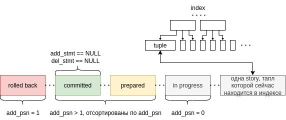
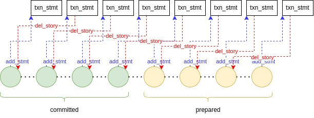
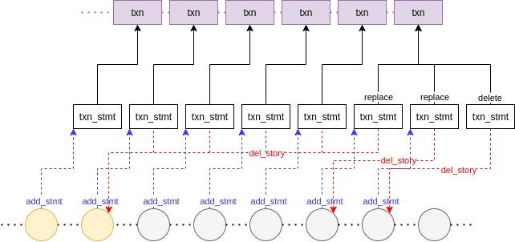
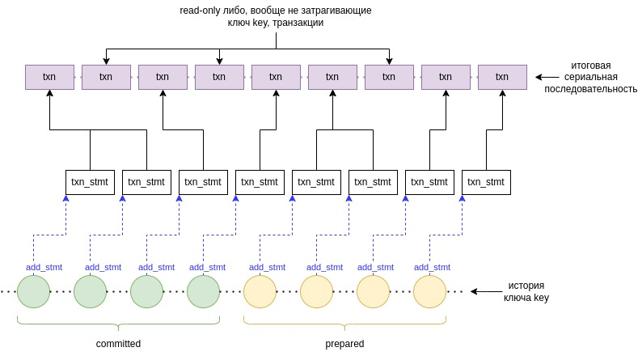
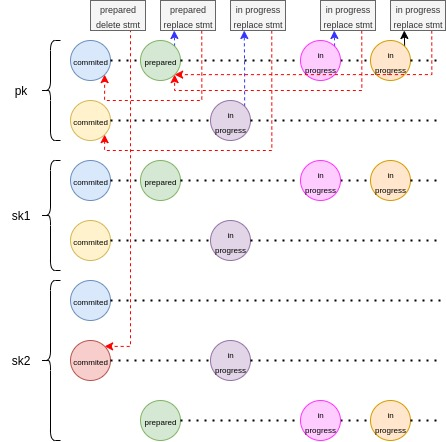
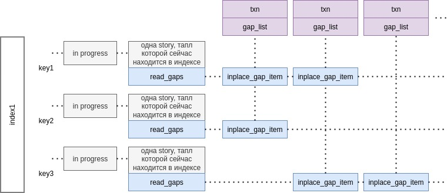
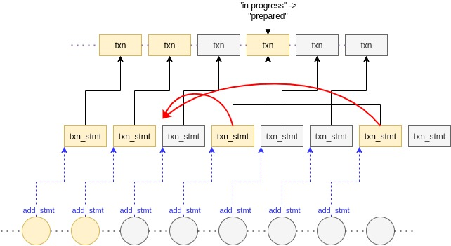
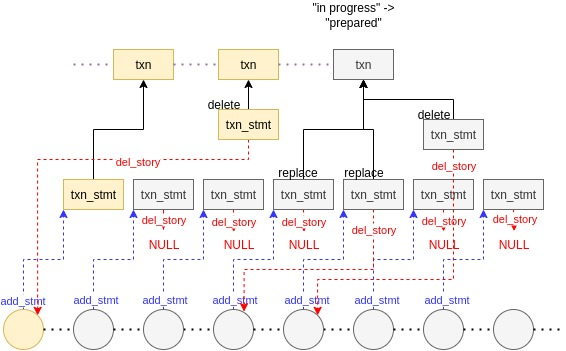

# MVCC in memtx

## Формулировка задачи:

Представим сначала, что у нас есть транзакции и они выполняются строго по очереди, одна за другой. Передачи управления от одной транзакции к другой в процессе происходить не могут.

Каждая транзакция представляет собой просто некоторую последовательность стейтментов двух типов: читающие (`read`) и пишущие (`write`).

Для простоты сначала разрешим всего один читающий стейтмент: `index:get(key)` по ключу `key` в уникальном индексе `index` (для простоты будем считать, что все индексы уникальные): результатом выполнения такого стейтмента должен быть тапл с соответствующим значением ключа, либо `nil`, если такого тапла нет.

Пишущих стейтментов будет всего 3: `index:insert(tuple)`, `index:replace(tuple)`, `index:delete(key)`:
- `index:insert(tuple)` вставляет тапл `tuple` в индекс `index`. При этом вставка может окончиться успехом только в том случае, если тапла с таким значением ключа в индексе пока не было, иначе `index:insert(tuple)` обязан бросить ошибку.
- `index:replace(tuple)` вставляет тапл в индекс `index`, если тапла с таким значением ключа пока не было в индексе, либо если такой тапл был, заменяет его.
- `index:delete(key)` удаляет тапл со значением ключа `key` из индекса и **возвращает этот тапл пользователю**.

К операциям `insert` и `replace` также предъявляется требование связанное с уникальностью. После выполнения операции вставки или замены, ни в одном из индексов не должно появиться дубликатов - никакой ключ не должен быть представлен в индексе более одного раза. Сейчас мы говорим о последовательном выполнении транзакций одной за другой без передач управления, поэтому фраза "после выполнения операции" имеет вполне понятный конкретный смысл, который при желании не трудно было бы определить более формально. "Представлен в индексе" не стоит понимать буквально, потому что, формально говоря, на физическом уровне в индексе может происходить вообще что угодно, лишь бы реализации умела с этим правильно справляться, нам важно только то, что будет наблюдать пользователь в этой и всех последующих транзакциях.

Теперь представим, что транзакции все таки выполняются конкурентно, периодически отдавая упраление друг другу. В этом случае хотелось бы иметь какую-то понятную предсказуемую семантику. Таковой, например, является **сериализуемое исполнение** - транзакции выполняются конкурентно, но при этом результат их исполнения эквивалентен некоторому последовательному выполнению. В любой момент времени для последовательности закоммиченных транзакций должна существовать некоторая перестановка $\pi$, такая что, выполнение транзакций в порядке данной перестановки выглядело бы для пользователя неотличимо от фактического результата их выполнения, которое он уже пронаблюдал - все стейтменты (`get`, `insert`, `replace`, `delete`) отработали бы в точности так же.

## Решение Tarantool Memtx-MVCC

В тарантуле транзакции могут находиться в нескольких состояниях: "rolled back", "committed", "prepared", "in progress". Почти про каждое из этих состояний по названию сразу понятно, что это состояние означает. Кроме "prepared". "Prepared" транзакции - это такие транзакции, которые уже перешли к процедуре коммита, и, что самое главное, получили PSN ("prepare sequence number"). На "committed" транзакциях вместе с "prepared" есть полный порядок - сначала идут все "committed" транзакции, затем все "prepared". При внутри "committed" транзакций порядок опрелен естественным образом - это тот порядок, в котором они закоммитились. "Prepared" упорядочены по их PSN, именно в таком порядке они будут коммититься, и соответственно тот же порядок на них сохранится, когда они станут "committed". **Не путайте этот порядок с порядком сериализуемости, эти порядки имеют некоторые отличия, которые сейчас обозначим.** Заметим еще, что в контексте данного разбора не будет никакого особого смысла разделять "committed" и "prepared" состояния, кроме того, что "prepared" транзакции еще могут откатиться, а "committed" - нет. В остальном каких-то заметных отличий между ними выделять не будем.

### Сериальный порядок

Для простоты понимания всего дальнейшего, сразу рассмотрим, как устроена эта перестановка $\pi$ из определения сериализуемости в случае с тарантулом. Все пишущие транзакции (транзакции, которые содержат хотя бы один пишущий стейтмент) будут идти в сериальной последовательности в том же порядке, в котором они вызвали `box_commit`, т.е. в том же порядке, в котором они перешли из состояния "in progress" в состояние "prepared" (порядке возрастания PSN). Читающие транзакции (состоящие только из читающих стейтментов) при этом могут "перемещаться в прошлое", т.е. могут идти раньше некоторых других транзакций несмотря на то, что в состояние "prepared" они перешли позже.

### Алгоритм

Первое что, наверное, что стоит сделать это в общих словах дать характеристику данного алгоритма. Данный алгоритм можно называть **"оптимистичным MVCC без отложенных транзакций (немедленное выполнение с оптимистичной проверкой конфликтов)"** - каждый стейтмент будет выполняться сразу же в момент, когда его передал пользователь, и результат выполнения этого стейтмента также определяется сразу в этот же момент. Кроме того, каждая транзакция отправится на коммит или откатится сразу в момент, когда об этом попросит пользователь. Пользователь вызывает `box_commit`, после чего транзакция сразу переходит из состояния "in progress" в состояние "prepared", и алгоритм сразу выполняет некоторые проверки, и, если не обнаруживает никаких конфликтов, коммитит транзакцию ("prepared"->"committed"), иначе откатывает ("prepared"->"rolled back"). Если пользователь вызывает `box_rollback` транзакция, естественно, в этот же момент откатывается. Вызывая `box_commit` пользователь тем самым сразу же присваивает транзакции PSN, определяя тот самый порядок, о котором говорили выше. Хотя это совсем не обязательно и для достижения гарантий сериализуемости вполне можно было бы придумать какие-нибудь стратегии, откладывающие каким-либо образом выполнение транзакции, данный алгоритм ничего не откладывает.

В каждом индексе у каждого ключа `key` будем поддерживать его историю (цепочку) - последовательность таплов с данным значением ключа `key`.

Последний тапл в каждой из таких последовательностей будет находиться в индексе - это инвариант, который будем аккуратно поддерживать. Пока у ключа есть какая-то непустая история, операция `delete(key)` не будет сразу физически удалять тапл из индекса, она лишь будет некоторым образом отражаться в элементах цепочки (версиях).

Будем отслеживать 2 типа фактов с помощью двух типов "трекеров" - `read(tuple)` и `gap`. И тот и другой трекер будут использоваться для того чтобы запомнить, что определенный стейтмент прочитал по определенному индексу, чтобы в дальнейшем гарантировать, что в получающемся сериальном порядке стейтмент прочитает то же самое. `read(tuple)` фиксирует тот факт, что стейтмент прочитал тапл `tuple` по данному ключу, а `gap` - то, что стейтмент не прочитал ничего по данному ключу. По сути все, чем мы будем заниматься - это следить за тем, чтобы все такие обнаруженные в процессе выполнения транзакции зависимости выполнялись. Кроме этого отдельным механизмом будет отслеживаться соблюдение условий уникальности для каждого индекса.

> [!IMPORTANT]
> **Важное свойство 1** не будем определять слишком формально. Скажем, что история одного ключа в любой момент времени **в любом индексе** выглядит следующим образом:

> [!NOTE]
> **Заметим:** `story` является последней в цепочке $\Leftrightarrow$ `story` (соответствующий тапл) находится в индексе.

Тип последней story, которая в данный момент находится в индексе, совпадает с типом блока, идущим перед ней. Например, в случае, изображенном на данной картинке, у этой story был бы тип "in progress".

> [!IMPORTANT]
> **Важное свойство 2:** `del_psn` $\neq$ 0 $\Rightarrow$ `add_psn` $\neq$ 0. (`story->del_psn` перестает быть равным 0, когда стейтмент `stmt`, т.ч. `stmt->del_story = story`, переходит из "in progress" в "prepared". При этом `stmt->del_story` становится равным `story` строго после того, как `story->add_psn` перестает равняться 0.)

> [!IMPORTANT]
> **Важное свойство 3:** в последовательности "committed" и "prepared" историй `add_stmt->del_story` следующего указывает на предыдущего:

> [!IMPORTANT]
> **Важное свойство 4:** для всех "in progress" story: `story->add_stmt->del_story` указывает на последнюю "prepared"/"сommitted" story $\Leftrightarrow$ `del_psn` последней story = 0. Если такой нет или её `del_psn` = 0, то `story->add_stmt->del_story == NULL` для всех них соответственно.

*Исключение составляют такие story, транзакция которых перед этим исполнила `insert` или `replace`. В этом случае такие стейтменты, конечно, будут указывать на соответствующие стори собственной транзакции.*

> [!IMPORTANT]
> **Важное свойство 5:** все стори одной "prepared"/"committed" транзакции, относящиеся к одному ключу key, идут подряд в цепочке для каждого из индексов. Здесь речь идет о транзакциях, которые более одного раза вызывали `insert`/`replace` на одном и том же ключе. Но это, конечно, не касается "in progress" транзакций, их стори, относящиеся к одной цепочке, не обязаны идти подряд, а могут чередоваться со стори из других транзакций.

> [!IMPORTANT]
> **Важное свойство 6** похоже на **свойство 4**. Все "in progress" `delete(key)` стейтменты указывают на последний элемент в "committed"/"prepared" отрезке соответствующей цепочки, если `del_psn` этого последнего элемента равен 0, иначе они все указывают на `NULL`, если `del_psn` этого последнего элемента $\neq$ 0.

*Исключение составляют такие `delete`-стейтменты, транзакция которых перед этим исполнила `insert` или `replace`. В этом случае такие стейтменты, конечно, будут указывать на соответствующие стори собственной транзакции.*

> [!NOTE]
> **Утверждение:** для любой цепочки любого ключа `key` в любом индексе, на отрезке "committed" и "prepared", транзакции их создавшие (`story->add_stmt->txn`) являются подпоследовательностью в сериальной последовательности (между ними могут ещё располагаться read-only транзакции, читавшие данный ключ `key`, а также любые транзакции, не затрагивавшие данный ключ `key` вообще).

В моменты, когда какая-то `story` меняет состояние "in progress"->"prepared", "prepared"->"committed" или "in progress"/"prepared"->"rolled back", мы будем обновлять некоторые ссылки так, чтобы все перечисленные выше свойства всегда выполнялись. Рассмотрим все возможные события жизненного цикла `story`, и посмотрим, что при этом делает алгоритм для того, чтобы сохранить справедливость всех этих утверждений:

#### in progress `txn_stmt` вставил тапл в индекс (вызвал `insert/replace(tuple)`)

Эта ситуация обрабатывается в `memtx_tx_history_add_insert_stmt`.

**(1)** Для тапла создается `story` (вызывается `memtx_tx_story_new`), которая добаляется в конец соответствующей цепочки в каждом из индексов. Таким образом, структура цепочки продолжает соответствовать приведенной в **свойстве 1**.

**(2)** Затем в последовательности из "commited" и "prepared" стейтментов **в первичном ключе** смотрим на последний элемент `last`, а именно на `last->del_psn`. Если `last->del_psn` $\neq$ 0, значит какой-то "prepared" стейтмент уже удалил данную `last` стори, соответственно, пока что считаем, что `story->del_story == NULL`. Иначе `story->del_story == last`. Таким образом, сохраняем истинность **свойства 4**.

Истинность **свойств 2 и 3**, очевидно, нарушиться не могла.

Каждая стори попадает сразу в несколько цепочек (по одной на каждый индекс). При этом из каждой стори исходит только одна `del_story` ссылка. Куда указывает эта ссылка, определяет первичный ключ. Стори может заменить только тот тапл `replaced_pk`, с которым пересекается по первичному ключу. При этом у нас есть условие, что должно быть заменено не более одного тапла, а значит по всем остальным вторичным ключам новый тапл либо не должен пересекаться ни с чем, либо c `replaced_pk`. Мы могли бы ввести `del_story` ссылки для каждого из индексов и проверять, что у всех вторичных индексов эти ссылки либо указывают на `NULL` либо туда же, куда указывает `del_story` ссылка в первичном индексе. По сути у нас и так будут эти ссылки, но в неявном виде. В явном виде будет только одна ссылка. А далее алгоритм постоянно будет отслеживать инвариант, что

> [!IMPORTANT]
> **Важное свойство 7:** все неявные (см. выше, что значит "неявные") `del_story`-ссылки по вторичным индексам указывают туда же, куда указывает явная ссылка.

Как только это свойство нарушится для какой-то стори `story` транзакции `txn`, транзакция `txn` сразу же отправится в read view или будет откачена с ошибкой.

**(3)**
Проверяем **свойство 7** (в реализации - функция `check_dup`), если нарушается отправляем в read view либо откатываем с ошибкой. В следующий раз этот инвариант будет проверяться всякий раз, когда какая-то транзакция перешла в состояние "prepared" (см. раздел **Транзакция перешла в состояние "prepared" (пользователь вызвал `commit`)**, подраздел **Обработка возможных дубликатов во вторичных индексах**.)

**Трекеры:** В конце описания каждого из возможных событий, будем рассматривать, что происходит с трекерами. В случае с `insert` нам важно затрекать тот факт, что до вставки никакого другого тапла по данному ключу не было, потому что как мы помним из постановки задачи, `insert` должен оканчиваться неудачей, если тапл с таким же значением ключа уже присутствует. Напомню, что для простоты мы считаем, что все индексы уникальные. Поэтому отсутствие другого тапла - это тот факт, справедливость которого нужно сохранить для итоговой сериальной последовательности. Для этого заводится соответствующий `gap`-трекер (его заводит `memtx_tx_track_story_gap`), который в реализации называется `inplace_gap_item`.

Все `gap`-трекеры хранятся в соответствующей цепочке соответствующего индекса. По сути они никак не связаны с самой цепочкой и её элементы. Каждый `inplace_gap_item` связан одним с ключом `key` и одной транзакцией `txn`, и говорит о том, что транзакция `txn` ничего не прочитала по ключу `key`. `inplace_gap_item` - это по сути связь "многие ко многим" между транзакциями и ключами. Для удобства реализация тарантула хранит все эти элементы в последней story в цепочке, а если цепочка пустая, то в хешмапе `point_holes` (`key` -> `inplace_gap_item`). Как в последствии будут обработаны `gap`-трекеры, обсудим позже.

> [!NOTE]
> **Замечание:** В нашей упрощенной постановке задачи нет `on_replace` триггеров, однако в тарантуле они есть. `on_replace` триггеры являются частью транзакции. В этом месте, если при вставке сработал какой-то `on_replace`-триггеры, пользователь в триггере получит тапл, который был заменен. Поэтому в данном случае будет создан ещё и `read`-трекер (его создает `memtx_tx_track_read_story` либо `memtx_tx_track_read`), чтобы гарантировать, что пользователь увидел бы точно такой же тапл, если бы транзакции выполнялись подряд в соответствии с сериальной последовательностью.
Как устроены `read`-трекеры обсудим позже.

#### in progress `txn_stmt` вызвал `delete(key)`

Эта ситуация обрабатывается в `memtx_tx_history_add_delete_stmt`. Транзакцию, которая вызвала этот `delete` назовем `txn`, а стейтмент - `txn_stmt`.
Все, что в этом случае делает алгоритм, - смотрит на тот же самый последний элемент `last` в "committed"/"prepared" отрезке соответствующей цепочки (в реализации вызывает `index_get_internal`). Если `last->del_psn` = 0, значит, тапл соотв. стори `last` пока не был удален.

Он не был удален в том смысле, что если наша транзакция `txn` прямо сейчас вызовет `commit`, она перейдет в состояние "prepared " и встанет в конец сериальной последовательности (никакие другие стейтменты связанные с данным ключом, уже не вставятся перед ней), она фактически будет удалять тапл соотв. стори `last`.

> [!NOTE]
> То есть для любой транзакции `txn`, модифицирующей ключ `key` мы в любой момени времени можем ответить на вопрос "как будет выглядеть подпоследователь сериальной последовательности, затрагивающая ключ `key`, вплоть до транзакции `txn`, если транзакция `txn` прямо сейчас вызовет `commit`?" Ответ на этот вопрос - это будет в точности отрезок "committed"/"prepared" соответствующей цепочки.

Запоминаем, что транзакция `txn` удалит `last`, если прямо сейчас перейдет в "prepared": `txn_stmt->del_story = last`. Иначе, если `last->del_psn` $\neq$ 0, то значит тапл с данным ключом отсутствует в том смысле, который был описан выше, и тогда `txn_stmt->del_story = NULL`.

**Важно понимать, что на `last` могут указывать несколько "in progress" транзакций**, некоторые из которых могут быть представлены в цепочке, а некоторые могут и не быть представлены в цепочке, если они просто вызывали `delete(key)`. Все эти транзакции находятся в списке `last->del_stmt`. `story->add_stmt` указывает ровно на один стейтмент, в `story->del_stmt` - на несколько, возможно на 0 стейтментов.

Таким образом, **свойство 6** продолжает оставаться истинным.

Цепочки никак не меняются, в том смысле, что никакие элементы в них не добавляются и не удаляются из них. Никакие story не меняют свое состояние. **Свойства 1-5**, очевидно, сохраняют справедливость.

Кроме того, поскольку `delete(key)` по условию возвращает удаленный тапл, либо `NULL`, если ничего не было удалено, мы должны завести `read` либо `gap` трекер соответственно.

#### транзакция перешла в состояние "prepared" (пользователь вызвал `commit`)

Каждый из стейтментов транзакции обрабатываются последовательно по очереди.

Посмотрим на стейтмент `stmt`, сделавший `insert`/`replace` (`stmt->add_story` $\neq$ `NULL`) (в реализации эта ситуация обрабатывается в `memtx_tx_history_prepare_insert_stmt`):

**(1)** В каждой из цепочек соответствующая `stmt->add_story` перемещается в конец "prepared" отрезка.
  
  
  Таким образом, сохраняются **свойство 1** и **свойство 5**.

**(2)** Далее возможны две ситуации:

**`stmt->del_story` = `NULL`**, это значит, что в цепочке вообще не было "committed"/"prepared" стори, либо для последней такой транзакции существует "prepared" `delete`-стейтмент. Это означает, что у всех "in progress" стори в цепочке `story->add_stmt->del_story` = `NULL` (кроме тех стори, которые собой пореплейсили какие-то таплы собственной транзакции `story->add_stmt->txn`).

Теперь в **первичной** цепочке появляется первый "prepared" `stmt->add_story`, который можно удалить, а значит всем этим "in progress" стори в **первичной** цепочке нужно выставить `story->add_stmt->del_story = stmt->add_story`. Тем самым сохраним справедливость **свойства 4**. Для этого алгоритм просто итерируется вперед по **первичной** цепочке начиная с первого "in progress" стори, и каждой стори, кроме тех которые перезаписывают что-то внутри своей транзакции, выставляет `story->add_stmt->del_story = stmt->add_story`.
Но кроме этого необходимо проследить за **свойством 6**. Для этого нужно просмотреть все `gap`-трекеры.

> [!NOTE]
> С трекерами философия следующая: в первый же момент, когда условие трекера начинает нарушаться, соответствующая транзакция, которая зависит от данного трекера откатывается с ошибкой `ER_CONFLICTED` (если это пишущая транзакция) либо отправляется в read view (если эта транзакция read only).

Конечно, при таком подходе возможны false-positive, потому что, вообще говоря, к моменту, когда транзакция будет коммититься, ситуация может несколько раз измениться и условия всех трекеров транзакции будут выполняться, однако алгоритм игнорирует подобные возможности.

> [!IMPORTANT]
> **Важное свойство 8:** необработанные `read`-трекеры могут указывать только на последний "prepared"/"committed" стори, и только если он еще не был удален `del_psn` = 0.

> [!IMPORTANT]
> **Важное свойство 9:** соответственно, необработанные `gap`-трекеры существовать для данного ключа `key` только, если последний "prepared"/"committed" стори в цепочке был удален `del_psn` $\neq$ 0, либо для данного ключа в данный момент вообще отстутствуют "prepared"/"committed" стори.

В данном случае, необходимо обработать все `gap`-трекеры (`memtx_tx_handle_conflict_gap_readers`).`read`-трекеров в этот момент для данного ключа быть не может, потому что все они были обработаны, когда происходило удаление (по свойству 8). Алгоритм итерируется по всем `gap`-трекерам, и отправляет соответствующие транзакции в read-view (что это такое обсудим позже), если транзакция read-only, либо откатывает с ошибкой `ER_CONFLICTED`.

**`stmt->del_story` $\neq$ `NULL`.** В индексе была какая-то "prepared"/"committed" стори `stmt->del_story`, на которую указывали какие-то стори в цепочке, а также `read`-трекеры. Для того, чтобы сохранить справедливость **свойства 4** необходимо всем стори, которые собирались удалить `stmt->del_story` переставить `del_story`-ссылки на `stmt->add_story`. Кроме того, могли еще быть необработанные `read`-трекеры, которые собирались удалить `stmt->del_story` (стейтменты, для которых принципиально важно, что они удалили, пореплейсили, или прочитали именно `stmt->del_story`). Соответственно, транзакции всех таких трекеров должны быть отправлены в read-view, либо откачены с ошибкой `ER_CONFLICTED`, в зависимости от того читающие они или пишущие.

**(3) Обработка возможных дубликатов во вторичных индексах.**

На шаге 1 мы обновили `del_story` всем стори, для которых он должен был измениться. Теперь все `del_story` ссылки указывают правильно. Но теперб необходимо проследить за тем, чтобы "неявные" `del_story` указывали туда же, куда указывает явная ссылка. Для этого во всех вторичных цепочках, в которых находится `stmt->add_story`, нужно проитерироваться по всем "in progress" стори и проверить, что их `del_story` ссылка указывает на `stmt->add_story`. Если это не так, соответствующие транзакции отправляются в read view либо откатываются с ошибкой, в зависимости от того читающие они или пишущие.

#### транзакция перешла в состояние "committed"
В реализации отсоединяется несколько ссылок и больше ничего. Как уже было замечено, при рассмотрении алгоритма, можно не особо-то разделять "committed" и "prepared" состояния.

#### транзакция перешла в состояние "rolled back"

Заметим, что откатиться может не только "prepared" транзакция, но и "in progress".

Во-первых, заметим, что "prepared" транзакции откатываются каскадно в обратном порядке, стейтменты внутри транзакции тоже откатываются в обратном порядке.

Рассмотрим случай, когда откатывается `insert`/`replace` стейтмент, то есть такой стейтмент `stmt`, который в момент выполнения создал стори `story` и поместил её в соответствующие цепочки по каждому из индексов:

**(1)** Соответствующая стори `stmt->add_story` получает `add_psn = 1` и перемещается в конец "rolled back" блока. Заметим, что из этого в совокупности с тем, что транзакции и стейтменты откатываются каскадно и в обратном порядке, следует, что "prepared" стори, соответствующая откатываемому стейтменту, обязательно стоит последней в "prepared" блоках соответствующих цепочек. После того, как данная стори откатится и переметится в блок "rolled back", последней в "prepared" блоке окажется другая (предыдущая) стори. А как мы помним, последняя "prepared" стори особенная, и у нас есть несколько важных свойств, связанных именно с последней "prepared" стори в цепочке. За всеми ними нужно внимательно проследить.

Если стейтмент был "prepared", требуется проследить за **свойствами 4, 6 и 7**.

За **свойством 7** в реализации проследить забыли: https://github.com/tarantool/tarantool/issues/11660/

**(2)** Если стейтмент был в состоянии "prepared". `stmt->add_story->add_psn = 0`, `stmt->del_story->del_psn = 0`.

**(3)** Если стейтмент был в состоянии "prepared". Необходимо пройти по всем "in progress" стейтментам, которые удаляли данный `stmt->add_story` и выставить для них `del_story`-ссылку на предыдущий "prepared" стейтмент, т.к. теперь он станет последним. Все такие стейтменты доступны через `stmt->add_story->del_stmt` список. Таким образом, свойства 4 и 6 сохраняют справедливость.

**(4)** Если стейтмент был в состоянии "prepared", могут существовать некоторые "in progress" транзакции в read view, которые читали данный стейтмент. Т.к. стейтмент последний в "prepared" блоке, то по **свойству 8** могут существовать актуальные `read`-трекеры для данной стори. Все эти транзакции откатываются.

> [!NOTE]
> Заметим, что `gap`-трекеров быть не может, т.к. никакой "prepared"-транзакции, удаляющей данный стори быть не может из-за каскадного роллбека (`stmt->add_story->del_psn` = 0). Тогда по **свойству 9** `gap`-трекеров нет.

**(5)** `stmt->add_story->del_psn = 1` - стори удалена ролбеком.

**Свойство 1** сохраняется за счет перемещения в "rolled back" блок, а также обновлений в шагах 2 и 5.

Теперь рассмотрим случай, когда откатывается `delete` стейтмент.

Так же как и в случае с откатом `insert`/`replace` стейтмента, данный случай нуждается в обработке **свойства 7**, которое в реализации также не обработали.

**(1)** Если стейтмент был в состоянии "prepared". `stmt->del_story` сейчас является последней в "prepared" блоках нескольких цепочек. Теперь откатывается стейтмент, удалявший данную стори. Необходимо восстановить справедливость свойств 4 и 6. Для того, чтобы восстановить справедливость **свойства 4** снова просто итерируемся по всем "in progress" стори в **первичной** цепочке и всем, кроме тех кто реплейсит что-то в своей же транзакции, переставляем ссылку `del_story` на `stmt->del_story`. **Свойство 6** на самом деле в восстановлении не нуждается, потому что `delete`, к счастью, заводит `read`-трекер, а значит, что все `delete` стейтменты были откачены с ошибкой.

**(2)** `stmt->del_story->del_psn` $\neq$ 0. Тогда по **свойству 9** могут быть какие-то необработанные `gap`-трекеры - итерируемся по индексам, и для каждого индекса откатываем с ошибкой все `gap`-трекеры.

> [!NOTE]
> Здесь мы именно откатываем все `gap`-трекеры, ничего не отправляем в read view, потому что в данном случае из сериальной последовательности пропал момент, когда ключ отсутствовал, в отличие от того случая, когда `insert`/`replace`-стейтмент переходил в состояние "prepared", тогда этот момент не пропадал, а уходил в прошлое, но мы знали, где он находится в сериальной последовательности, и read only транзакцию вполне можно было отправить туда.

**(3)** `stmt->del_story->del_psn = 0`.

**(4)** Разрываем `del_story`-связь между `stmt` и `stmt->del_story`.

#### `get(key)` запрос

Все это время в момент возникновения некоторых конфликтов мы отправляли read only транзакции в read view, однако до сих пор не обсудили, что это такое.

До этого мы всегда смотрели на последнюю "prepared"/"committed" транзакцию в цепочке. Теперь же мы сделаем исключение, читающие транзакции, которые были отправлены в read view, смогут читать более старые стори из прошлого. В момент, когда read only транзакция отправляется в read view, мы будем запоминать `rv_psn`, который будет определять место данной транзакции в пишущей попоследовательности итоговой сериальной последовательности. Как было видно, транзакция `victim` отправляется в read view только в момент, когда какая-то другая транзакция `breaker` становится "prepared" и начинает конфликтовать с `victim`. В этот момент `victim` отправляется в read view и получает `rv_psn = breaker->psn`, это означает, что read only `victim` будет видеть только тот префикс итоговой сериальной последовательности, у которого `psn < rv_psn`.
